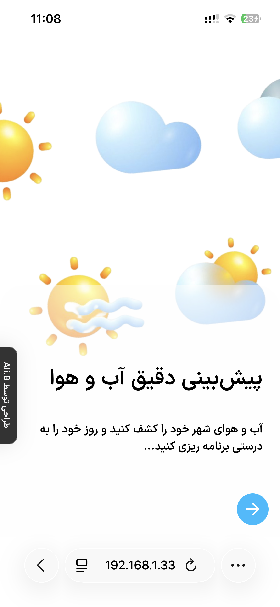
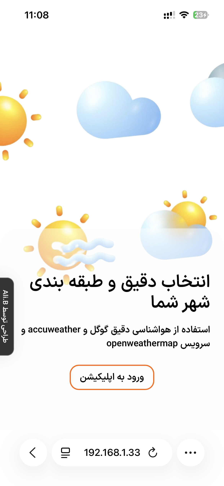
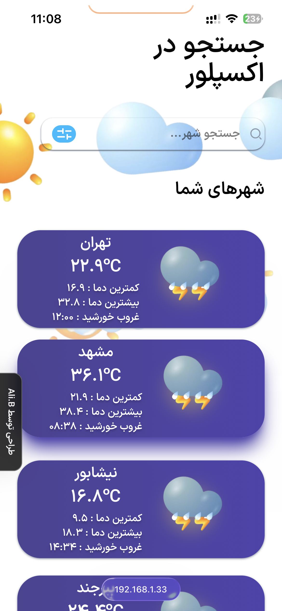
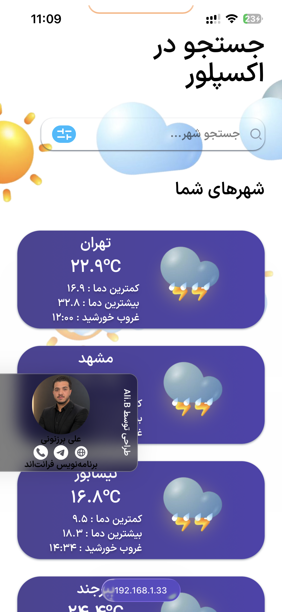

# 🌦️ Weather App | اپلیکیشن هواشناسی

A modern and responsive Weather Application built with **React**, **Tailwind CSS**, and **React Router**, powered by a Weather API to display real-time weather information.

یک اپلیکیشن مدرن و واکنش‌گرا برای نمایش اطلاعات آب‌وهوا که با **React**، **Tailwind CSS** و **React Router** توسعه داده شده و اطلاعات را به‌صورت لحظه‌ای از طریق **Weather API** دریافت می‌کند.


---

## 🚀 Features | امکانات

### 🇬🇧 English

- ⚛️ Built with React
- 🎨 Styled using Tailwind CSS
- 📱 Fully Responsive Design
- 🌐 Fetches real-time weather data from API
- 🔀 Navigation with React Router
- 🧩 Component-Based Architecture
- ⚡ Fast and lightweight UI
- 📍 Display weather information for cities
- 🔄 Dynamic API data rendering
- 💻 Clean and maintainable code structure

---

### 🇮🇷 فارسی

- ⚛️ توسعه یافته با React
- 🎨 طراحی شده با Tailwind CSS
- 📱 کاملاً واکنش‌گرا (Responsive)
- 🌐 دریافت اطلاعات آب‌وهوا به صورت لحظه‌ای از API
- 🔀 مسیریابی با React Router
- 🧩 معماری کامپوننت محور
- ⚡ رابط کاربری سریع و سبک
- 📍 نمایش اطلاعات آب‌وهوای شهرها
- 🔄 بروزرسانی و نمایش داینامیک داده‌های API
- 💻 ساختار کدنویسی تمیز و قابل توسعه

---

## 🛠️ Technologies

- React
- Tailwind CSS
- React Router DOM
- JavaScript (ES6+)
- Fetch API
- REST API
- Vite

---

## 📂 Project Structure

```text
src/
│
├── assets/
├── components/
├── App.jsx
└── main.jsx
```

---

## 📡 API

This project uses a Weather REST API to fetch weather data dynamically.

این پروژه برای دریافت اطلاعات آب‌وهوا از یک REST API استفاده می‌کند.

---

## 📱 Responsive

The application is optimized for:

- Desktop 💻
- Tablet 📱
- Mobile 📲

---

## 🎯 Learning Objectives

This project was developed to practice:

- React Components
- React Hooks
- State Management
- Fetch API
- REST API Integration
- React Router
- Responsive Design
- Clean Project Architecture

---

## 📸 Preview

> Add screenshots of your application here.

<div style="display: flex; direction:row" align="center">

  
  
  
  
  
</div>
---

## ⚙️ Installation

```bash
git clone https://github.com/your-username/weather_app.git

cd weather_app

npm install

npm run dev
```

---

## ⭐ Future Improvements

- 🔍 Search city by name
- ❤️ Favorite cities
- 🌙 Dark / Light Mode
- 📅 7-Day Weather Forecast
- 📍 Current Location Weather
- 🌍 Multi-language Support
- 📊 Weather Charts

---

## 👨‍💻 Developer

## Made with Ali.B ❤️ using React & Tailwind CSS.

## 👨‍💻 Design By Figma

Made With https://www.figma.com/design/qNQEAC01EB7tDTeRiALV5m/Weather-App-UI-KIT--Community-?node-id=0-1&p=f&t=510FnVVvpHSWkBMl-0
